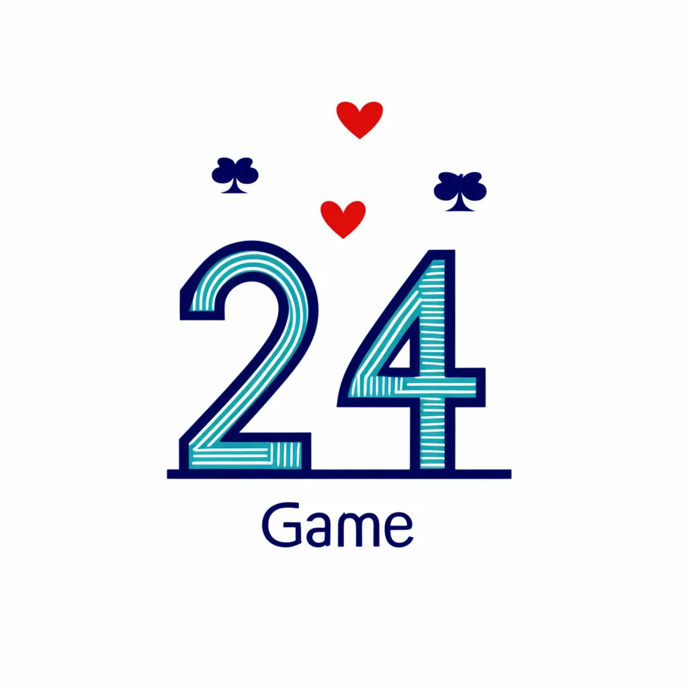
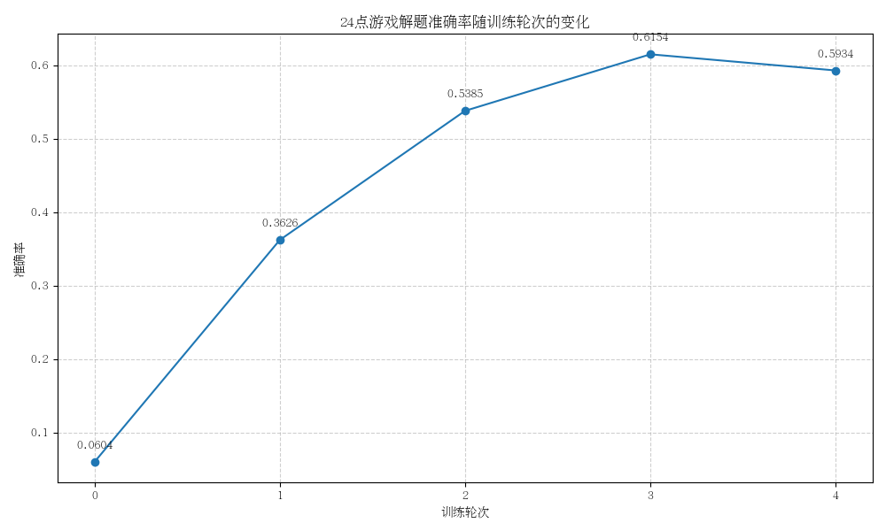

# 24-Game-Reasoning

<div align="center">
  <a href="README_ZH.md">中文</a> | <a href="README.md">English</a>
</div>

<div align="center">
  
</div>

<!-- <div align="center">
  
</div> -->

## Introduction

The 24 Game is a classic mathematical game that requires using 4 numbers and basic operations (addition, subtraction, multiplication, division) to obtain the result 24. This project aims to enhance the reasoning and self-verification capabilities of Large Language Models (LLMs) in the 24 Game through different training methods (Zero-RL, SFT, SFT+RL).

### Game Rules

- Given a deck of cards, the goal is to use the numbers from four cards and arithmetic operations to reach a final result of 24
- Each card must be used exactly once
- You can use addition (+), subtraction (-), multiplication (×), and division (÷)
- You can use parentheses () to change the order of operations
- No other operators or numbers can be used
- Division results can be decimal or infinite recurring numbers

For example: If the four cards are 3, 3, 8, 8, you can get the answer through (8÷3(3-8÷3))=24.

## Environment Setup

### Installation with Conda

```bash
# Create conda environment
conda create -n 24game python=3.10
conda activate 24game

# Install dependencies
pip install -r requirements.txt

# If you need VLLM for accelerated inference
pip install vllm
```

## Project Structure

```
24-Game-Reasoning/
├── data/                      # Dataset directory
│   ├── 24game_grpo/           # RL dataset
│   └── 24game_sft/            # SFT dataset
├── docs/                      # Documentation
├── images/                    # Images directory
│   ├── examples/              # Example images
│   └── results/               # Result visualization images
├── results/                   # Evaluation results
├── scripts/                   # Scripts directory
│   ├── data_processing/       # Data processing scripts
│   ├── evaluation/            # Evaluation scripts
│   └── training/              # Training scripts
├── templates/                 # Prompt templates
├── utils/                     # Utility functions
├── verl/                      # RL training framework
├── .gitignore                 # Git ignore file
├── README.md                  # English README
├── README_ZH.md               # Chinese README
└── requirements.txt           # Python dependencies
```

## Usage

### 1. Data Preparation

First, you need to generate the 24 Game dataset:

```bash
# Generate 24 Game data
python scripts/data_processing/data_preparation.py
```

### 2. Training Models

This project implements three training methods: Zero-RL, SFT, and SFT+RL.

#### 2.1 Zero-RL Training

The Zero-RL method directly uses RL to train the base model without prior SFT:

```bash
cd verl
bash scripts/run_qwen25_math_grpo.sh
```

#### 2.2 SFT Training

The SFT (Supervised Fine-Tuning) method uses human-annotated data for supervised fine-tuning:

```bash
cd verl
bash scripts/run_qwen25_math_sft.sh 4 None  # 4 indicates using 4 GPUs
```

#### 2.3 SFT+RL Training

The SFT+RL method first performs SFT training, then follows with RL training:

```bash
cd verl
bash scripts/run_qwen25_math_grpo_sft_rl.sh
```

### 3. Evaluating Models

Use the evaluation script to assess trained models:

```bash
python scripts/evaluation/eval.py --base_model_path /path/to/model --val_data_path data/24game_sft/val.parquet
```

## Experimental Results

### Accuracy Comparison

<div align="center">
  
  <p>Zero-RL Method Accuracy Trend</p>
</div>

<div align="center">
  
  <p>SFT Method Accuracy Trend</p>
</div>

<div align="center">
  
  <p>SFT+RL Method Accuracy Trend</p>
</div>

### Relationship Between Thinking Length and Accuracy

<div align="center">
  
  <p>SFT Method: Thinking Length vs Accuracy</p>
</div>

<div align="center">
  
  <p>Zero-RL Method: Thinking Length vs Accuracy</p>
</div>

<div align="center">
  
  <p>SFT+RL Method: Thinking Length vs Accuracy</p>
</div>

### Method Comparison

We compared three methods (Zero-RL, SFT, SFT+RL) on the 24 Game:

1. **Zero-RL**: Directly uses RL to train the base model without prior SFT
2. **SFT**: Uses human-annotated data for supervised fine-tuning
3. **SFT+RL**: First performs SFT training, then follows with RL training

The experimental results show that the SFT+RL method achieved the best performance in terms of accuracy and reasoning ability, while the Zero-RL method also demonstrated good performance, especially with longer chains of thought.

## Conclusion

Through the experiments in this project, we found that:

1. RL training can effectively enhance the model's reasoning and self-verification capabilities in the 24 Game
2. There is a positive correlation between the length of the chain of thought and accuracy, but excessively long chains may lead to computational resource waste
3. The SFT+RL combination method achieves the best results, but the Zero-RL method is also an effective training strategy

These findings have significant implications for enhancing the mathematical reasoning and self-verification capabilities of large language models and can be applied to a wider range of mathematical problem-solving and logical reasoning tasks.

## Citation

If you use this project in your research, please cite it using the following format:

```bibtex
@misc{24GameReasoning2024,
  author = {Wei, Shaohang},
  title = {24-Game-Reasoning: Enhancing LLM's Reasoning and Self-Verification Capabilities},
  year = {2025},
  publisher = {GitHub},
  journal = {GitHub Repository},
  howpublished = {\url{https://github.com/sylvain-wei/24-Game-Reasoning}}
}
```

## License

This project is licensed under the MIT License. See the [LICENSE](LICENSE) file for details. 