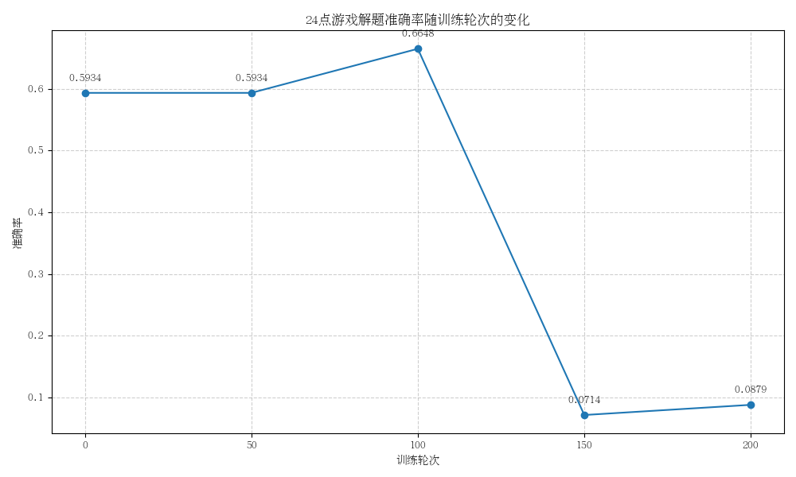

# 24-Game-Reasoning

<div align="center">
  <a href="README_ZH.md">中文</a> | <a href="README.md">English</a>
</div>

<div align="center">
  
</div>

<!-- <div align="center">
  
</div> -->

## 简介

24点游戏是一个经典的数学游戏，要求使用4个数字和基本运算（加减乘除）得到结果24。本项目旨在通过不同的训练方法（Zero-RL、SFT、SFT+RL）来增强大语言模型（LLM）在24点游戏中的推理能力和自主验证能力。

### 游戏规则

- 给定一副扑克牌，目标是使用四张牌的数字和加减乘除运算，最终得出结果24
- 每张牌必须且只能使用一次
- 可以使用加 (+)、减 (-)、乘 (×)、除 (÷) 四种运算
- 可以使用括号 () 改变运算顺序
- 不能使用其他运算符号或数字
- 除法运算中结果允许是小数和无限循环除不尽

例如：四张牌是 3, 3, 8, 8，可以通过 (8÷3(3-8÷3))=24 来得到答案。

## 环境配置

### 使用Conda安装

```bash
# 创建conda环境
conda create -n 24game python=3.10
conda activate 24game

# 安装依赖
pip install -r requirements.txt

# 如果需要使用VLLM进行推理加速
pip install vllm
```

## 项目结构

```
24-Game-Reasoning/
├── data/                      # 数据集目录
│   ├── 24game_grpo/           # RL数据集
│   └── 24game_sft/            # SFT数据集
├── docs/                      # 文档
├── images/                    # 图片目录
│   ├── examples/              # 示例图片
│   └── results/               # 结果可视化图片
├── results/                   # 评估结果
├── scripts/                   # 脚本目录
│   ├── data_processing/       # 数据处理脚本
│   ├── evaluation/            # 评估脚本
│   └── training/              # 训练脚本
├── templates/                 # 提示模板
├── utils/                     # 工具函数
├── verl/                      # RL训练框架
├── .gitignore                 # Git忽略文件
├── README.md                  # 英文README
├── README_ZH.md               # 中文README
└── requirements.txt           # Python依赖
```

## 使用方法

### 1. 数据准备

首先需要生成24点游戏数据集：

```bash
# 生成24点游戏数据
python scripts/data_processing/data_preparation.py
```

### 2. 训练模型

本项目实现了三种训练方法：Zero-RL、SFT和SFT+RL。

#### 2.1 Zero-RL训练

Zero-RL方法直接使用RL训练基础模型，无需先进行SFT：

```bash
cd verl
bash scripts/run_qwen25_math_grpo.sh
```

#### 2.2 SFT训练

SFT（Supervised Fine-Tuning）方法使用人类标注的数据进行监督微调：

```bash
cd verl
bash scripts/run_qwen25_math_sft.sh 4 None  # 4表示使用4个GPU
```

#### 2.3 SFT+RL训练

SFT+RL方法先进行SFT训练，然后再进行RL训练：

```bash
cd verl
bash scripts/run_qwen25_math_grpo_sft_rl.sh
```

### 3. 评估模型

使用评估脚本对训练好的模型进行评估：

```bash
python scripts/evaluation/eval.py --base_model_path /path/to/model --val_data_path data/24game_sft/val.parquet
```

## 实验结果

### 准确率对比

<div align="center">
  
  <p>Zero-RL方法的准确率变化趋势</p>
</div>

<div align="center">
  
  <p>SFT方法的准确率变化趋势</p>
</div>

<div align="center">
  
  <p>SFT+RL方法的准确率变化趋势</p>
</div>

### 思考长度与准确率关系

<div align="center">
  
  <p>SFT方法的思考长度与准确率关系</p>
</div>

<div align="center">
  
  <p>Zero-RL方法的思考长度与准确率关系</p>
</div>

<div align="center">
  
  <p>SFT+RL方法的思考长度与准确率关系</p>
</div>

### 方法对比

我们比较了三种方法（Zero-RL、SFT、SFT+RL）在24点游戏上的表现：

1. **Zero-RL**：直接使用RL训练基础模型，无需先进行SFT
2. **SFT**：使用人类标注的数据进行监督微调
3. **SFT+RL**：先进行SFT训练，然后再进行RL训练

实验结果表明，SFT+RL方法在准确率和推理能力上取得了最好的效果，而Zero-RL方法也展现出了良好的性能，特别是在长思考链上的表现。

## 结论

通过本项目的实验，我们发现：

1. RL训练能够有效提升模型在24点游戏中的推理能力和自主验证能力
2. 思考链的长度与准确率存在正相关关系，但过长的思考链可能导致计算资源浪费
3. SFT+RL组合方法能够取得最佳效果，但Zero-RL方法也是一种有效的训练策略

这些发现对于增强大语言模型的数学推理能力和自主验证能力具有重要意义，可以应用于更广泛的数学问题求解和逻辑推理任务中。

## 引用

如果您在研究中使用了本项目，请按以下格式引用：

```bibtex
@misc{24GameReasoning2024,
  author = {Wei, Shaohang},
  title = {24-Game-Reasoning: Enhancing LLM's Reasoning and Self-Verification Capabilities},
  year = {2025},
  publisher = {GitHub},
  journal = {GitHub Repository},
  howpublished = {\url{https://github.com/sylvain-wei/24-Game-Reasoning}}
}
```

## 许可证

本项目采用 MIT 许可证。详情请参阅 [LICENSE](LICENSE) 文件。
